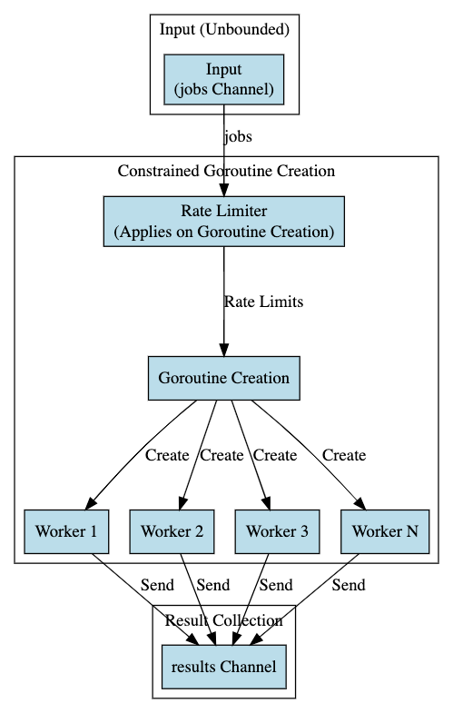

# Understanding Dynamic Rate-Limited Worker Pool Pattern in Golang

The Dynamic Rate-Limited Worker Pool pattern is an enhanced concurrency model in Go that controls the rate at which
workers process jobs, ensuring that the system handles workload efficiently without overwhelming resources or external
systems.

## Table of Contents

1. [Introduction to Dynamic Rate-Limited Worker Pool](#introduction)
2. [When to Use](#when-to-use)
3. [Common Pitfalls and Issues](#common-pitfalls-and-issues)
4. [Best Practices](#best-practices)
5. [Resources](#resources)

## Introduction

The Dynamic Rate-Limited Worker Pool pattern combines rate limiting and worker pools to control the flow of jobs being
processed concurrently. This pattern is crucial when dealing with external systems that have rate limits, or when
there's a need to control the rate of job processing to prevent resource exhaustion.

## When to Use

- **External Rate Limits**:
    - When interacting with external systems that have rate limits, this pattern ensures adherence to those limits.

- **Resource Management**:
    - Effectively manage system resources to prevent overload, especially in scenarios where the job processing rate
      could potentially overwhelm the system.

- **Controlled Parallel Processing**:
    - Where there's a need for controlled parallel processing of jobs to achieve efficiency while maintaining system
      stability.

## When Not to Use

- **Simple Sequential Processing**:
    - For simple or sequentially processed tasks, a rate-limited worker pool may introduce unnecessary complexity.

- **Unbounded Rate of Job Generation**:
    - If the rate of job generation is unbounded, there may be other patterns or strategies that could be more
      appropriate to handle such scenarios.

- **Low Traffic Scenarios**:
    - In low traffic or low workload scenarios, the overhead of managing rate limits and worker pools might outweigh the
      benefits.

## Common Pitfalls and Issues

- **Uncontrolled Rate Limiting**:
    - Setting an inappropriate rate limit could still lead to resource exhaustion or may not fully utilize the available
      resources.

- **Error Handling**:
    - Ensure proper error handling especially when the rate limiter or the worker encounters an error.

## Best Practices

- **Dynamic Rate Adjustments**:
    - Implement mechanisms to adjust the rate limit dynamically based on system load or other metrics.

- **Monitoring and Logging**:
    - Implement robust monitoring and logging to track the system's behavior and performance over time.

- **Graceful Shutdown**:
    - Ensure a graceful shutdown process to handle in-flight jobs and cleanup resources.

## Resources

- [Go by Example: Rate Limiting](https://gobyexample.com/rate-limiting)