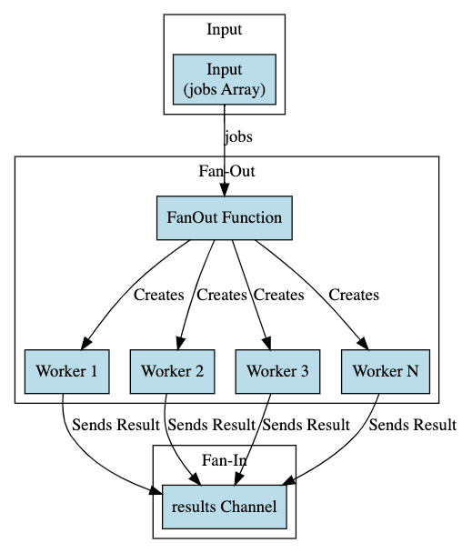

# Understanding Fan-out, Fan-in Design Pattern in Golang

The Fan-out, Fan-in design pattern is a core concept in concurrency models which entails distributing multiple tasks
among several goroutines (fan-out) and then combining their results into a single channel (fan-in). This pattern can
significantly improve performance by parallelizing CPU or I/O-bound work.

## Table of Contents

1. [Introduction to Fan-out, Fan-in](#introduction)
2. [When to Use](#when-to-use)
3. [Implementing Fan-out, Fan-in in Go](#implementing)
4. [Common Pitfalls and Issues](#common-pitfalls-and-issues)
5. [Best Practices](#best-practices)
6. [Resources](#resources)

## Introduction

In a Fan-out phase, multiple goroutines read from the same channel until the channel is closed. This phase is best
suited for distributing work that does not need to be executed sequentially.

In a Fan-in phase, multiple channels consolidate their results into a single channel which can be read from to get the
aggregated result.

## When to Use

- **I/O Bound Scenarios**:
    - Fan-out, Fan-in can be beneficial in scenarios where there are I/O-bound tasks that can be performed concurrently.

- **CPU Bound Scenarios**:
    - Similarly, in CPU-bound tasks, this pattern can also leverage multicore processors by distributing computation
      across multiple goroutines.

- **Finite Tasks**:
    - It's better suited for a finite set of tasks as an infinite input stream could potentially create an unmanageable
      number of goroutines.

## When Not to Use

- **Simple or Sequential Tasks**:
    - If the tasks are simple or must be processed sequentially, the overhead of managing goroutines and channels may
      outweigh the benefits of parallelization.

- **Infinite Input Stream**:
    - For an unbounded or infinite input stream, the fan-out phase could potentially spawn a large number of goroutines
      leading to resource exhaustion.

- **Highly Coupled Tasks**:
    - If tasks have dependencies on each other or need to share state, the complexity of managing these dependencies
      might make the Fan-out, Fan-in pattern less suitable.

- **Latency Sensitive Scenarios**:
    - The fan-out, fan-in pattern could introduce additional latencies due to goroutine and channel management, which
      might not be acceptable in latency-sensitive applications.

## Common Pitfalls and Issues

- **Uncontrolled Goroutine Creation**:
    - In the fan-out phase, creating an uncontrolled number of goroutines could lead to resource exhaustion.

- **Deadlocks**:
    - Ensure proper synchronization to avoid deadlocks, especially during the fan-in phase.

## Best Practices

- **Control Goroutine Creation**:
    - Control the number of goroutines created during the fan-out phase to avoid overwhelming the system resources.

- **Proper Synchronization**:
    - Ensure all goroutines finish executing and all channels are properly closed to prevent deadlocks and ensure all
      results are collected.

- **Error Handling**:
    - Implement proper error handling to manage errors that may occur during the processing of tasks.

## Resources

- [Go Concurrency Patterns: Pipelines and cancellation](https://blog.golang.org/pipelines)