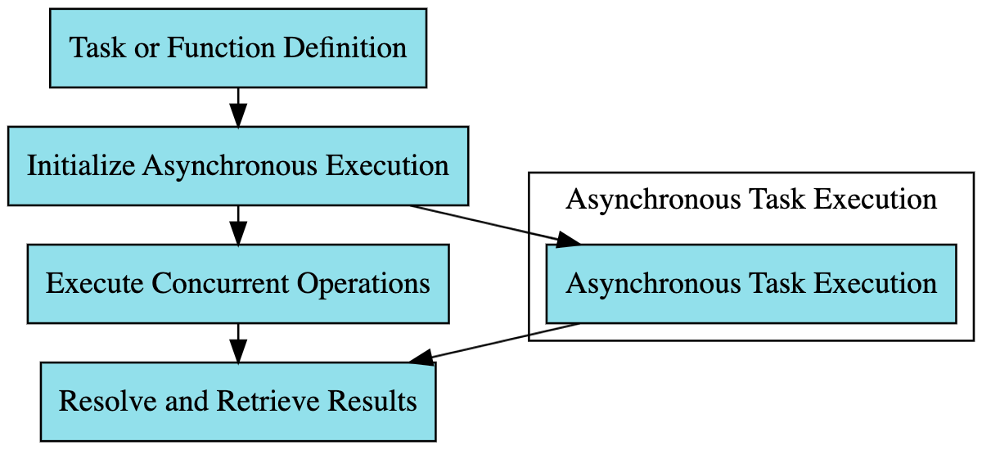

# Understanding The Future Design Pattern in Golang

The Future design pattern is a software design pattern used to represent a result that is expected to be available in
the future. It is particularly useful in scenarios where computations or tasks are executed asynchronously. In Go, this
pattern can be implemented using channels and goroutines.

## Table of Contents

1. [Introduction to the Future Pattern](#introduction)
2. [Use Cases](#use-cases)
3. [Common Pitfalls](#common-pitfalls)
4. [Best Practices](#best-practices)
5. [Resources](#resources)

## Introduction

The Future Pattern is a design pattern that helps in handling potentially blocking computation by running them in
separate goroutines and allowing the calling code to access the result once it's ready. This pattern allows for
concurrent execution of tasks and can significantly improve the performance of I/O-bound and CPU-bound programs.

## Use Cases

- **I/O-bound tasks**: Tasks such as network requests or file I/O can be executed asynchronously using the Future
  pattern.
- **CPU-bound tasks**: Heavy computations can be offloaded to separate goroutines, allowing the main goroutine to remain
  responsive.

## Common Pitfalls

- **Ignoring errors**: It's easy to ignore errors when using the Future pattern. Ensure to handle errors properly to
  avoid silent failures.
- **Resource leaks**: Ensure to properly manage resources, especially when dealing with I/O operations.

## Best Practices

- **Error Handling**: Include error handling in your Future implementation to ensure that errors are propagated back to
  the calling code.
- **Timeouts**: Implement timeouts to avoid waiting indefinitely for a result.
- **Buffered Channel**: Use a buffered channel to prevent blocking, especially if the consumer might be slower than the
  producer.

## Common Implementations

- **ErrGroup**: The [`errgroup`](https://pkg.go.dev/golang.org/x/sync/errgroup) package in Go provides a way to
  synchronize and collect errors from a group of goroutines, effectively implementing a form of the Future pattern.
  With `errgroup`, you can start multiple goroutines, wait for all of them to complete, and collect any errors that
  occur.

