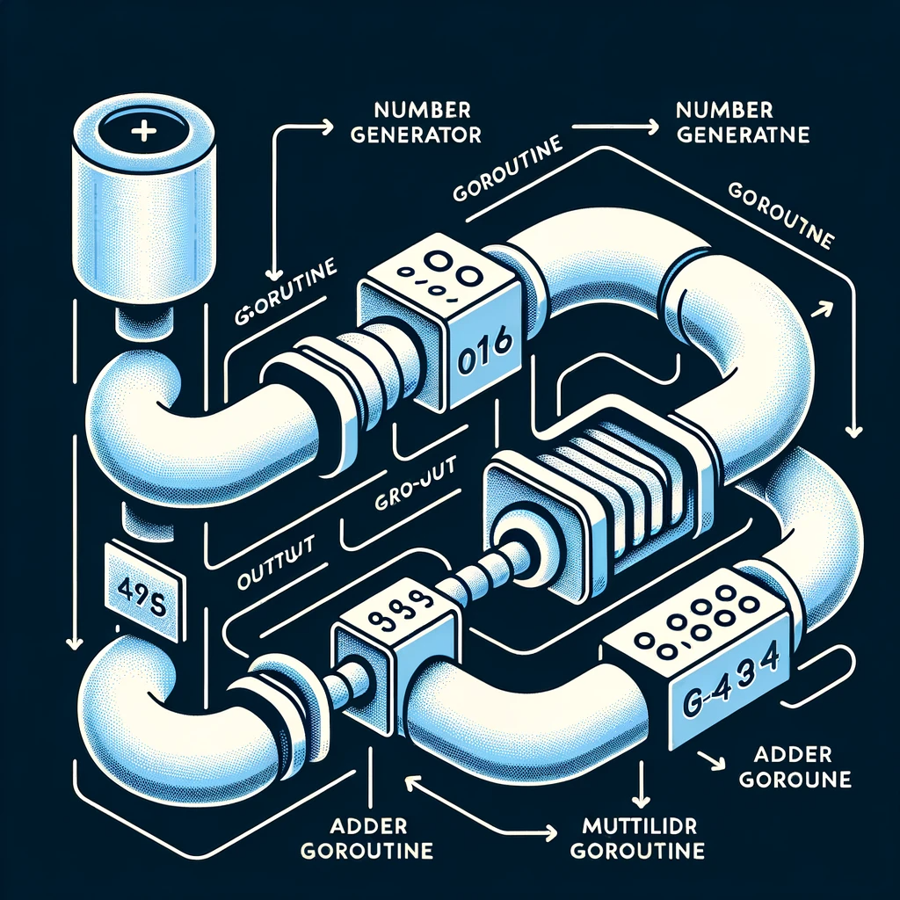
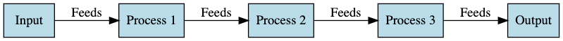

# Understanding the Pipeline Pattern in Golang

The Pipeline pattern is instrumental in setting up a series of processing elements, arranged so that the output of each
element is the input of the next. In Golang, this pattern is implemented using channels and goroutines.

## Table of Contents

1. [Introduction](#introduction)
2. [When to Use](#when-to-use)
3. [When Not to Use](#when-not-to-use)
4. [Common Pitfalls](#common-pitfalls)
5. [Best Practices](#best-practices)
6. [Resources](#resources)

## Introduction

Each stage in the pipeline is usually a goroutine, and channels are used to pass data and errors between these stages,
effectively managing the flow of data and error propagation.

## When to Use

- **Stream Processing**: When there's a need to process streams of data sequentially or in stages.
- **Data Transformation**: Transforming data in stages where the output of one stage is the input to the next.
- **Workflows**: Defining workflows where tasks need to be executed in a particular sequence.

## When Not to Use

- **Simple Tasks**: For simple, single-step tasks or operations, a pipeline might be overkill.
- **Highly Interactive Operations**: Operations that require a high degree of interactivity between stages might be
  better suited to other design patterns.

## Common Pitfalls

- **Error Handling**: Ensuring errors are correctly propagated through the pipeline is crucial.
- **Deadlocks**: Improper management of channels could lead to deadlocks.

## Best Practices

- **Separation of Concerns**: Each stage should have a single responsibility.
- **Error Handling**: Ensure that errors are propagated and handled correctly to prevent silent failures.

## Resources

- [Go Concurrency Patterns: Pipelines and cancellation](https://blog.golang.org/pipelines)
- [Building pipelines in Go](https://medium.com/statuscode/pipeline-patterns-in-go-a37bb3a7e61d)
