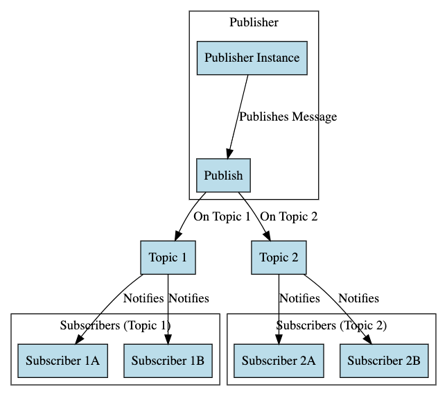

# Understanding The Pub/Sub Pattern in Golang

The Publish/Subscribe (Pub/Sub) pattern is a messaging pattern where senders (publishers) send messages without the
program needing to specify the recipients (subscribers). The pattern is widely used to build event-driven architectures.

## Table of Contents

1. [Introduction to the Pub/Sub Pattern](#introduction)
2. [Implementing the Pub/Sub Pattern](#implementation)
3. [Use Cases](#use-cases)
4. [Common Pitfalls](#common-pitfalls)
5. [Best Practices](#best-practices)
6. [Resources](#resources)

## Introduction

The Pub/Sub pattern decouples the sender and receiver, promoting a clean separation of concerns.

## Implementation

## Use Cases

- **Event Notification**: Notify interested parties when certain events occur.
- **Real-time Updates**: Providing real-time updates in applications.

## Common Pitfalls

- **Message Loss**: Messages may get lost if there are no subscribers or if a subscriber is too slow to process
  messages.

## Best Practices

- **Error Handling**: Ensure proper error handling to deal with failures in the messaging process.
- **Unsubscribing**: Always unsubscribe when done to prevent memory leaks.

## Resources

- [Go by Example: Range over Channels](https://gobyexample.com/range-over-channels)
- [Effective Go](https://golang.org/doc/effective_go.html)