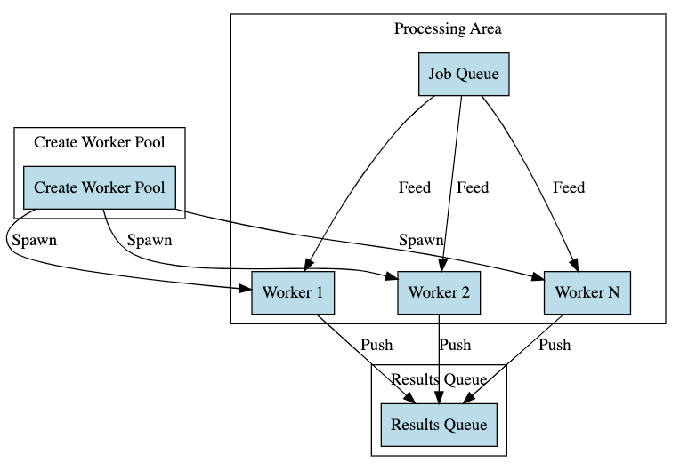

# Understanding Golang Worker Pools

Worker Pools are a design pattern in Go that allow you to efficiently manage and reuse worker goroutines to process
multiple tasks in parallel, effectively controlling the level of concurrency. They can be especially useful in scenarios
where spawning a new goroutine for every task can lead to high memory usage and scheduler overhead.

## Table of Contents

1. [Introduction](#introduction)
2. [Use Cases](#use-cases)
3. [Common Pitfalls](#common-pitfalls)
4. [Best Practices](#best-practices)
5. [Resources](#resources)

## Introduction

In a Worker Pool pattern, a fixed number of worker goroutines are created and placed in a pool. Each worker continuously
pulls tasks from a shared job queue, processes them, and places the results in a shared result queue.

## Use Cases

- **IO-bound tasks:** When the tasks primarily involve IO operations like reading from disk, sending network requests,
  etc.
- **CPU-bound tasks:** When the tasks require significant CPU computations.
- **Rate limiting:** To control the rate at which tasks are processed.

## Common Pitfalls

- **Under-utilizing Workers:** Creating too few workers may not fully utilize the available CPU and IO resources.
- **Over-utilizing Workers:** Creating too many workers may overwhelm the system, leading to high memory usage and
  scheduler overhead.
- **Deadlocks:** Be careful to avoid deadlocks by ensuring all channels are properly closed and all goroutines can exit.

## Best Practices

- **Adjustable Worker Count:** Allow the number of workers to be adjusted based on the workload and system resources.
- **Error Handling:** Ensure robust error handling within the worker goroutines to prevent panics and ensure accurate
  results.
- **Graceful Shutdown:** Implement a mechanism to gracefully shut down the worker pool, ensuring that all in-progress
  tasks are completed before exiting.

## Resources

- [Go by Example: Worker Pools](https://gobyexample.com/worker-pools)
- [Writing a Worker Pool in Go](https://www.youtube.com/watch?v=ryz179yBQgE)
- [Building Worker Pools in Go](https://8thlight.com/blog/kyle-krull/2018/11/07/building-worker-pools-in-go.html)